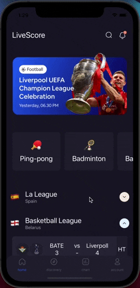

<div align="center">
  
</div>

<br>

<h1 align="center">React Native Accordion (Reanimated 2)</h1>
<p align="center">Performance oriented React Native Accordion 60 FPS.  A simple component of a common use case of collapsible - a visible title with a collapsible view beneath it.</p>
<h6 align="center">Made with ❤️ by developer for developers</h6>

<br>
<p align="center">


</p>


## Thanks
<p>Please, click on ⭐ button.</p>


## Table of Contents

- [Installation](#installation)
- [Features](#features)
- [Usage](#usage)
- [Props](#props)
- [Methods](#methods)
- [Example](#example)
- [Contributing](#contributing)
- [Support](#support)
- [License](#license)


## Installation

<p>Expo:</p>


```bash
$ expo install @dev-event/react-native-accordion
```


<p>React Native (0.60+):</p>

```bash
$ yarn add @dev-event/react-native-accordion
```
and package:

```bash
$ yarn add @dev-event/react-native-accordion
```


## Features

- Supported Reanimated 2;
- Fully supported on React Native and Expo;
- Simple API but fully customizable;
- Arrow animation indicating whether the collapsible is expanded or not;
- Property which unmount the collapsible when it is not expanded(very useful for performance! use wisely(Beta);

## Usage

For more complete example open [App.tsx](https://github.com/dev-event/react-native-accordion/blob/main/example/src/App.tsx)

```tsx
import React, { useState, useCallback } from "react";
import { StyleSheet, View, Text,  StatusBar} from "react-native";
import AnimatedAccordion from "@dev-event/react-native-accordion";


const App: React.FC = () => {
  const [show, setShow] = useState<boolean>(false);

  const handleContentTouchable = useCallback(() => {
    return <Text style={styles.title}>Sample header</Text>
  }, [])

  const handleContent = useCallback(() => {
    return <Text style={styles.message}>Sample content</Text>
  }, [])

  return (
    <>
      <StatusBar barStyle="dark-content" />
      <View style={styles.content}>
          <AnimatedAccordion
            sizeIcon={16}
            styleChevron={styles.icon}
            renderContent={handleContent}
            onChangeState={(isShow) => setShow(isShow)}
            styleTouchable={styles.touchable}
            activeBackgroundIcon={theme.light_gray}
            inactiveBackgroundIcon={theme.light_gray}
            handleContentTouchable={handleContentTouchable}
          />
      </View>
    </>
  );
};


const styles = StyleSheet.create({
  content:{
    flex: 1,
    backgroundColor: "#FFFFFF"
  },
  touchable: {
    backgroundColor: '#181829',
    height: 50,
  },
  title: {
    fontSize: 14,
    color: '#FFFFFF',
    fontWeight: '500',
  },
  message: {
    fontSize: 16,
    color: '#FFFFFF',
    fontWeight: '500',
  },
  icon: {
    height: 24,
    width: 24,
  },
});

```


## Props

- `ref?`: ref
- `isArrow?`: boolean
- `disabled?`: boolean
- `initExpand?`: boolean
- `colorIcon?`: string
- `sizeIcon?`: number
- `otherProperty?`: ViewProps
- `isStatusFetching?`: boolean
- `isUnmountedContent?`: boolean
- `activeBackgroundIcon?`: string;
- `inactiveBackgroundIcon?`: string;
- `contentHeight?`:  number
- `handleIcon?`:  () => void
- `onAnimatedEndExpanded?`:  () => void
- `onAnimatedEndCollapsed?`:  () => void
- `handleCustomTouchable?`:  () => void
- `handleContentTouchable?`:  () => void
- `handleIndicatorFetching?`:  () => void
- `renderContent?`:  () => void;
- `configExpanded?`: object;
- `configCollapsed?`: object;
- `styleChevron?`: `StyleProp<ViewStyle>`;
- `styleTouchable?`: `StyleProp<ViewStyle>`;
- `styleContainer?`: `StyleProp<ViewStyle>`;

## Methods

- `onChangeState?`: (isShowView: boolean) => void
- `openAccordion`: () => void

<h2 id="built-with">Built With ❤️</h2>

- [react-native-reanimated](https://github.com/software-mansion/react-native-reanimated)
- [react-native-redash](https://github.com/wcandillon/react-native-redash)
- [react-native-svg](https://github.com/react-native-community/react-native-svg)
- [@react-native-community/bob](https://github.com/react-native-community/bob)


## 🎉 Example

Checkout the example [here](https://github.com/dev-event/react-native-accordion/tree/main/example/src).

## ✌️ Contributing

Pull requests are always welcome! Feel free to open a new GitHub issue for any changes that can be made.

## Author

Reach out to me at one of the following places!

- E-mail <a href="#" target="_blank">effectwaater@gmail.com</a>
- Medium at <a href="https://medium.com/@effectwaaters" target="_blank">https://medium.com/@effectwaaters </a>
- Instagram at <a href="https://www.instagram.com/dev_event/" target="_blank">https://www.instagram.com/dev_event/ </a>


## License

[](http://badges.mit-license.org)

- **[MIT license](http://opensource.org/licenses/mit-license.php)**
